# GoLink — 基于 go-zero 的高性能短链接系统

> 🎯 一个可直接用于 Go 后端实习/校招面试的微服务项目，从架构设计到编码落地完整展示。

## 项目概述

GoLink 是一个高性能短链接服务，将长 URL 转换为短码（如 `http://domain/3xK9mR`），访问时 302 重定向回原始地址。核心指标：**生成低延迟 < 5ms，重定向 P99 < 2ms**。

**技术栈：** Go 1.24 · go-zero · gRPC · MySQL · Redis · Kafka · etcd · Docker

## 架构

```
                  ┌─────────────┐
                  │   Client    │
                  └──────┬──────┘
                         │ HTTP
                  ┌──────▼──────┐
                  │ API Gateway │  :8888  go-zero rest
                  │ (gin-like)  │
                  └──┬──────┬───┘
              gRPC  │      │  gRPC
       ┌────────────▼┐    ┌▼────────────┐
       │  Link RPC    │    │  Stats RPC  │  :9000 / :9001
       │  shorten     │    │  getStats   │  go-zero zrpc
       │  redirect    │    └──────┬──────┘
       └──┬───┬───┬──┘           │
          │   │   │              │
     ┌────▼┐ ┌▼──▼┐         ┌───▼───┐
     │MySQL│ │Redis│         │ MySQL │
     │8.0  │ │  7  │         │       │
     └─────┘ └┬───┬┘         └───────┘
              │   │
        Bloom │   │ Cache
        Filter│   │
              │   │
          ┌───▼───▼──┐     ┌──────────┐
          │  Kafka    │────▶│LogConsumer│  异步写入
          │  access   │     │  消费日志  │  access_logs
          │  _logs    │     └──────────┘  + link_stats
          └───────────┘
```

## 核心设计

### 1. 短码生成 — Snowflake + Base62

```
雪花ID (64位) → Base62编码 → 短码 (例: "3xK9mR")
```

- 用 Snowflake 替代数据库自增，避免单点瓶颈，分布式下天然不冲突
- Base62 编码，6 位即可支持 62⁶ ≈ 568 亿个链接
- 支持**自定义短码**（用户指定 `mylink` 而非随机码）

### 2. 重定向 — 三级缓存查询

```
Bloom Filter → Redis → MySQL
     ↓(miss)       ↓(miss)      ↓(hit 回写 Redis)
 快速拒绝不存在    命中直接返回    查DB兜底
 的短码 (零DB开销)
```

- **Bloom Filter**：用 1000 万位的 Redis Bitmap，7 个哈希函数，误判率 ~0.01%。绝大多数不存在短码的请求被拦截在第一步
- **Redis Cache**：Cache-Aside 模式，命中直接返回
- **MySQL 兜底**：查库后异步回写 Redis 缓存

### 3. 访问日志 — Kafka 异步解耦

```go
// redirectLogic 中不阻塞响应
go func() {
    producer.SendAccessLog(ctx, &msg)
}()
```

重定向请求不等待日志写入，通过 goroutine 异步投递 Kafka，LogConsumer 后端消费：

```
Kafka 消息 → LogConsumer → INSERT access_logs
                         → UPSERT link_stats (PV+1, 按天统计)
```

### 4. 统计数据 — 按天去重 UV

`link_stats` 表以 `(short_code, date)` 为唯一索引，消费者的 upsert 实现：

```sql
INSERT INTO link_stats (short_code, date, pv, uv)
VALUES (?, ?, 1, 1)
ON DUPLICATE KEY UPDATE pv = pv + 1;
```

## 目录结构

```
shortlink/
├── api/gateway/         # HTTP 网关层 (:8888)
│   ├── gateway.api      # go-zero API 定义
│   ├── internal/
│   │   ├── handler/     # 路由处理 (shorten/redirect/stats)
│   │   ├── logic/       # 业务逻辑 → 调用 RPC
│   │   └── svc/         # 服务上下文 (RPC 客户端注入)
├── rpc/
│   ├── link/            # Link RPC 服务 (:9000)
│   │   ├── link.proto   # protobuf 定义
│   │   └── internal/logic/
│   │       ├── shortenLogic.go  # 短链接生成
│   │       └── redirectLogic.go # 重定向 + 异步 Kafka
│   └── stats/           # Stats RPC 服务 (:9001)
│       ├── stats.proto
│       └── internal/logic/statsLogic.go
├── service/logconsumer/ # Kafka 消费者 (日志入库 + 统计)
├── common/              # 共享库
│   ├── model/           # GORM 模型 (Link, User, AccessLog, LinkStat)
│   ├── base62/          # Base62 编解码 (零改动复用)
│   ├── snowflake/       # 雪花 ID 生成器
│   ├── bloom/           # Redis 布隆过滤器
│   ├── mq/              # Kafka 生产者封装
│   ├── middleware/      # JWT 认证中间件
│   └── utils/           # bcrypt 密码 + JWT
├── scripts/
│   ├── init_db.sql      # 建表 DDL (4 张表)
│   └── init_bloom.go    # 布隆冷启动脚本
├── deploy/docker/       # 4 个 Dockerfile
├── docker-compose.yml   # 8 服务编排
└── go.work              # Go workspace (5 模块)
```

## 快速启动

```bash
# 1. 启动基础设施
docker compose up -d mysql redis etcd kafka

# 2. 初始化布隆过滤器
cd scripts && go run init_bloom.go

# 3. 启动 RPC 服务
cd rpc/link  && go run link.go  -f etc/link.yaml &
cd rpc/stats && go run stats.go -f etc/stats.yaml &

# 4. 启动消费者
cd service/logconsumer && go run main.go &

# 5. 启动网关
cd api/gateway && go run gateway.go -f etc/gateway.yaml &

# 6. 测试
# 生成短链接
curl -X POST http://localhost:8888/api/shorten \
  -H "Content-Type: application/json" \
  -d '{"url":"https://github.com"}'

# 重定向
curl -v http://localhost:8888/3xK9mR

# 查看统计
curl http://localhost:8888/api/stats/3xK9mR
```

## 数据表设计

| 表 | 用途 | 关键索引 |
|----|------|----------|
| links | 短链接映射 | `short_code`(unique), `user_id`, `expire_at` |
| access_logs | 访问记录 | `short_code`, `created_at` |
| link_stats | 按天统计 | `(short_code, date)` unique |
| users | 用户 (认证用) | `username`(unique), `email`(unique) |


## 性能测试报告

### 1. 测试目标

评估短链接重定向接口 (`GET /:code`) 在不同部署环境下的吞吐量与延迟特性。核心调用链：HTTP 路由 → Bloom Filter 判定 → Redis 缓存查询 → 302 响应。

### 2. 测试环境

| 项目 | 环境 A | 环境 B |
|------|--------|--------|
| **设备** | Windows 11 工作站 | ASUS TUF 笔记本 |
| **CPU** | Intel Core i7-13700 | Intel Core i5 (12 代) |
| **内存** | 32 GB | 15 GB |
| **操作系统** | Windows 11 + WSL2 | Ubuntu 22.04.5 LTS |
| **Go 版本** | 1.24.3 | 1.24.3 |
| **MySQL** | Docker 8.0 (容器) | 8.0.46 (原生) |
| **Redis** | Docker 7-alpine (容器) | 6.0.16 (原生) |
| **部署方式** | `docker compose` 全容器 | 裸进程 `go build` |
| **网络** | WSL2 Hyper-V bridge + NAT | 内核 loopback (`127.0.0.1`) |

### 3. 测试方案

| 项目 | 说明 |
|------|------|
| **压测工具** | wrk 4.1.0 (`--latency`) |
| **目标接口** | `GET /:code` |
| **并发模型** | 4 线程 × 100 连接，长连接 |
| **预热** | 200 次请求后开始采集 |
| **采样时长** | 30 秒 |
| **观测指标** | QPS、P50/P75/P90/P99 延迟、错误率 |

### 4. 测试结果

#### 4.1 吞吐量与延迟

| 指标 | 环境 A (Docker Desktop) | 环境 B (裸机) |
|------|------------------------|-------------|
| **QPS** | 775 | **23,435** |
| **P50** | 127.06 ms | **4.00 ms** |
| **P75** | — | **5.11 ms** |
| **P90** | — | **5.58 ms** |
| **P99** | 206.66 ms | **6.97 ms** |
| **Max** | — | 29.82 ms |
| **错误率** | 0% | 0% |

#### 4.2 延迟分布 (环境 B, wrk 输出)

```
Latency Distribution
   50%    4.00 ms
   75%    5.11 ms
   90%    5.58 ms
   99%    6.97 ms
```

#### 4.3 不同并发级别 (环境 B)

| 并发连接数 | QPS | P50 | P99 |
|-----------|------|-----|-----|
| 100 | 23,435 | 4.00 ms | 6.97 ms |
| 500 | 23,095 | 20.69 ms | 29.99 ms |

> 500 并发时 QPS 无明显衰减，延迟增长主要来自 goroutine 调度排队，非资源泄漏或锁竞争。

### 5. 耗时分解

```mermaid
gantt
    title 请求处理耗时分解 (P50)
    dateFormat X
    axisFormat %s ms

    section 环境 A — Docker Desktop
    gRPC 调用 (跨容器)             :crit, a1, 0, 8
    Bloom Filter (7× BIT)          :crit, a2, 8, 10
    Redis GET (容器内)             :crit, a3, 10, 13
    WSL2 虚拟网络栈延迟            :crit, a4, 13, 127

    section 环境 B — 裸机
    HTTP 路由 + gRPC 序列化        :active, b1, 0, 2
    Bloom Filter (7× BIT)          :active, b2, 2, 3
    Redis GET (loopback)           :active, b3, 3, 4
    302 响应                       :active, b4, 4, 4
```



| 耗时来源 | 占比 | 说明 |
|---------|------|------|
| gRPC 调用 (序列化+传输+反序列化) | ~1.0 ms | 本地 loopback，无网络开销 |
| Bloom Filter (7 次 BIT) | ~0.5 ms | Redis Bitmap，同机 loopback |
| Redis GET | ~0.5 ms | Cache-Aside 命中路径 |
| MySQL (首次回源) | ~2.0 ms | GORM AutoMigrate + 首次查询 |
| 总计 | **~4.0 ms** | — |

### 6. 结论

1. **环境是瓶颈，非代码**。环境 B 裸机 QPS 为环境 A 的 30 倍，延迟低 97%。差异根因为 WSL2 Hyper-V 虚拟交换机 + Docker bridge NAT 每一跳引入的网络栈穿越开销，与业务代码无关。

2. **gRPC 开销可控**。本地 loopback 下 gRPC 调用额外增加约 1 ms（序列化 + 传输），对于微服务架构拆分的收益来说是可接受的代价。

3. **并发稳定性良好**。100 → 500 并发时 QPS 无明显下降 (23,435 → 23,095)，延迟上升符合排队论预期，系统无单点瓶颈。

4. **P99/P50 比值 ~1.75**，表明延迟分布集中，无异常长尾。请求处理时间高度一致。

