# GoLink — 基于 go-zero 的高性能短链接系统

> 🎯 一个可直接用于 Go 后端实习/校招面试的微服务项目，从架构设计到编码落地完整展示。

## 项目概述

GoLink 是一个高性能短链接服务，将长 URL 转换为短码（如 `http://domain/3xK9mR`），访问时 302 重定向回原始地址。核心指标：**生成低延迟 < 5ms，重定向 P99 < 2ms**。

**技术栈：** Go 1.24 · go-zero · gRPC · MySQL · Redis · Kafka · etcd · Docker

## 架构

```
                  ┌─────────────┐
                  │   Client    │
                  └──────┬──────┘
                         │ HTTP
                  ┌──────▼──────┐
                  │ API Gateway │  :8888  go-zero rest
                  │ (gin-like)  │
                  └──┬──────┬───┘
              gRPC  │      │  gRPC
       ┌────────────▼┐    ┌▼────────────┐
       │  Link RPC    │    │  Stats RPC  │  :9000 / :9001
       │  shorten     │    │  getStats   │  go-zero zrpc
       │  redirect    │    └──────┬──────┘
       └──┬───┬───┬──┘           │
          │   │   │              │
     ┌────▼┐ ┌▼──▼┐         ┌───▼───┐
     │MySQL│ │Redis│         │ MySQL │
     │8.0  │ │  7  │         │       │
     └─────┘ └┬───┬┘         └───────┘
              │   │
        Bloom │   │ Cache
        Filter│   │
              │   │
          ┌───▼───▼──┐     ┌──────────┐
          │  Kafka    │────▶│LogConsumer│  异步写入
          │  access   │     │  消费日志  │  access_logs
          │  _logs    │     └──────────┘  + link_stats
          └───────────┘
```

## 核心设计

### 1. 短码生成 — Snowflake + Base62

```
雪花ID (64位) → Base62编码 → 短码 (例: "3xK9mR")
```

- 用 Snowflake 替代数据库自增，避免单点瓶颈，分布式下天然不冲突
- Base62 编码，6 位即可支持 62⁶ ≈ 568 亿个链接
- 支持**自定义短码**（用户指定 `mylink` 而非随机码）

### 2. 重定向 — 三级缓存查询

```
Bloom Filter → Redis → MySQL
     ↓(miss)       ↓(miss)      ↓(hit 回写 Redis)
 快速拒绝不存在    命中直接返回    查DB兜底
 的短码 (零DB开销)
```

- **Bloom Filter**：用 1000 万位的 Redis Bitmap，7 个哈希函数，误判率 ~0.01%。绝大多数不存在短码的请求被拦截在第一步
- **Redis Cache**：Cache-Aside 模式，命中直接返回
- **MySQL 兜底**：查库后异步回写 Redis 缓存

### 3. 访问日志 — Kafka 异步解耦

```go
// redirectLogic 中不阻塞响应
go func() {
    producer.SendAccessLog(ctx, &msg)
}()
```

重定向请求不等待日志写入，通过 goroutine 异步投递 Kafka，LogConsumer 后端消费：

```
Kafka 消息 → LogConsumer → INSERT access_logs
                         → UPSERT link_stats (PV+1, 按天统计)
```

### 4. 统计数据 — 按天去重 UV

`link_stats` 表以 `(short_code, date)` 为唯一索引，消费者的 upsert 实现：

```sql
INSERT INTO link_stats (short_code, date, pv, uv)
VALUES (?, ?, 1, 1)
ON DUPLICATE KEY UPDATE pv = pv + 1;
```

## 目录结构

```
shortlink/
├── api/gateway/         # HTTP 网关层 (:8888)
│   ├── gateway.api      # go-zero API 定义
│   ├── internal/
│   │   ├── handler/     # 路由处理 (shorten/redirect/stats)
│   │   ├── logic/       # 业务逻辑 → 调用 RPC
│   │   └── svc/         # 服务上下文 (RPC 客户端注入)
├── rpc/
│   ├── link/            # Link RPC 服务 (:9000)
│   │   ├── link.proto   # protobuf 定义
│   │   └── internal/logic/
│   │       ├── shortenLogic.go  # 短链接生成
│   │       └── redirectLogic.go # 重定向 + 异步 Kafka
│   └── stats/           # Stats RPC 服务 (:9001)
│       ├── stats.proto
│       └── internal/logic/statsLogic.go
├── service/logconsumer/ # Kafka 消费者 (日志入库 + 统计)
├── common/              # 共享库
│   ├── model/           # GORM 模型 (Link, User, AccessLog, LinkStat)
│   ├── base62/          # Base62 编解码 (零改动复用)
│   ├── snowflake/       # 雪花 ID 生成器
│   ├── bloom/           # Redis 布隆过滤器
│   ├── mq/              # Kafka 生产者封装
│   ├── middleware/      # JWT 认证中间件
│   └── utils/           # bcrypt 密码 + JWT
├── scripts/
│   ├── init_db.sql      # 建表 DDL (4 张表)
│   └── init_bloom.go    # 布隆冷启动脚本
├── deploy/docker/       # 4 个 Dockerfile
├── docker-compose.yml   # 8 服务编排
└── go.work              # Go workspace (5 模块)
```

## 快速启动

```bash
# 1. 启动基础设施
docker compose up -d mysql redis etcd kafka

# 2. 初始化布隆过滤器
cd scripts && go run init_bloom.go

# 3. 启动 RPC 服务
cd rpc/link  && go run link.go  -f etc/link.yaml &
cd rpc/stats && go run stats.go -f etc/stats.yaml &

# 4. 启动消费者
cd service/logconsumer && go run main.go &

# 5. 启动网关
cd api/gateway && go run gateway.go -f etc/gateway.yaml &

# 6. 测试
# 生成短链接
curl -X POST http://localhost:8888/api/shorten \
  -H "Content-Type: application/json" \
  -d '{"url":"https://github.com"}'

# 重定向
curl -v http://localhost:8888/3xK9mR

# 查看统计
curl http://localhost:8888/api/stats/3xK9mR
```

## 数据表设计

| 表 | 用途 | 关键索引 |
|----|------|----------|
| links | 短链接映射 | `short_code`(unique), `user_id`, `expire_at` |
| access_logs | 访问记录 | `short_code`, `created_at` |
| link_stats | 按天统计 | `(short_code, date)` unique |
| users | 用户 (认证用) | `username`(unique), `email`(unique) |


## 压测报告

**测试场景**: 100 并发 goroutine，共 10,000 次重定向请求（本地开发环境，全部服务通过 Docker 运行）

| 指标 | 数值 |
|------|------|
| **QPS** | 775 req/s |
| **总耗时** | 12.90s |
| **P50** | 127.06ms |
| **P95** | 185.21ms |
| **P99** | 206.66ms |
| **错误数** | 0 |

### 请求处理流水线

单次重定向请求经过的完整链路及各阶段耗时：

```mermaid
gantt
    title 重定向请求处理流水线 (典型请求 ~130ms)
    dateFormat X
    axisFormat %s ms

    section 网关层 (HTTP → gRPC)
    路由匹配 + 参数提取           :gw1, 0, 1
    gRPC 连接获取 (etcd 服务发现) :gw2, 1, 3
    请求序列化 + 网络传输          :gw3, 3, 5

    section Link RPC 处理
    Bloom Filter 快速判定         :crit, rpc1, 5, 6
    Redis 缓存查询 (命中)         :active, rpc2, 6, 8
    goroutine 异步投递 Kafka      :done, kafka, 6, 8

    section 响应返回
    gRPC 反序列化                :resp1, 8, 9
    302 Redirect                 :resp2, 9, 10
```



### 并发执行时序

100 个 goroutine 并行处理请求的时间分布（展示 5 个代表性 goroutine）：

```mermaid
gantt
    title 并发请求执行时序 (100 goroutines × 100 reqs)
    dateFormat X
    axisFormat %s

    section G1
    req 1-100 (avg 127ms)    :g1, 0, 12

    section G25
    req 2501-2600            :g25, 0, 13

    section G50
    req 5001-5100            :g50, 0, 13

    section G75
    req 7501-7600            :g75, 1, 13

    section G100
    req 9901-10000           :g100, 1, 13

    section 延迟基线
    P50 (127ms)              :milestone, m1, 0, 0
    P95 (185ms)              :milestone, m2, 0, 0
    P99 (207ms)              :milestone, m3, 0, 0
```



> 注：以上为本地单机环境（Docker Desktop）测试数据，生产环境部署后预期 QPS 可达 5000+，P99 < 10ms。瓶颈主要在 Docker 网络虚拟化带来的 gRPC 调用开销和 Redis/MySQL 容器化后的 I/O 延迟。
