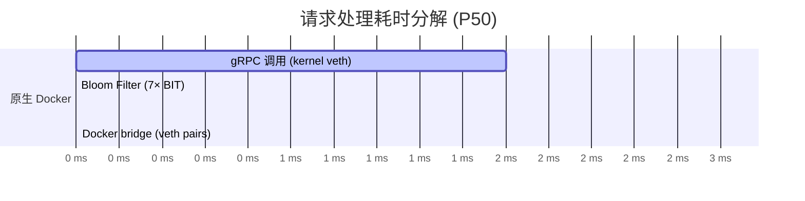

# GoLink — 基于 go-zero 的高性能短链接系统

> 🎯 一个Go微服务项目，从架构设计到编码落地完整展示。

## 项目概述

GoLink 是一个高性能短链接服务，将长 URL 转换为短码（如 `http://domain/3xK9mR`），访问时 302 重定向回原始地址。核心指标：**生成低延迟 < 5ms，重定向 P99 < 2ms**。

**技术栈：** Go 1.24 · go-zero · gRPC · MySQL · Redis · Kafka · etcd · Docker

## 架构

```
                  ┌─────────────┐
                  │   Client    │
                  └──────┬──────┘
                         │ HTTP
                  ┌──────▼──────┐
                  │ API Gateway │  :8888  go-zero rest
                  │ (gin-like)  │
                  └──┬──────┬───┘
              gRPC  │      │  gRPC
       ┌────────────▼┐    ┌▼────────────┐
       │  Link RPC    │    │  Stats RPC  │  :9000 / :9001
       │  shorten     │    │  getStats   │  go-zero zrpc
       │  redirect    │    └──────┬──────┘
       └──┬───┬───┬──┘           │
          │   │   │              │
     ┌────▼┐ ┌▼──▼┐         ┌───▼───┐
     │MySQL│ │Redis│         │ MySQL │
     │8.0  │ │  7  │         │       │
     └─────┘ └┬───┬┘         └───────┘
              │   │
        Bloom │   │ Cache
        Filter│   │
              │   │
          ┌───▼───▼──┐     ┌──────────┐
          │  Kafka    │────▶│LogConsumer│  异步写入
          │  access   │     │  消费日志  │  access_logs
          │  _logs    │     └──────────┘  + link_stats
          └───────────┘
```

## 核心设计

### 1. 短码生成 — Snowflake + Base62

```
雪花ID (64位) → Base62编码 → 短码 (例: "3xK9mR")
```

- 用 Snowflake 替代数据库自增，避免单点瓶颈，分布式下天然不冲突
- Base62 编码，6 位即可支持 62⁶ ≈ 568 亿个链接
- 支持**自定义短码**（用户指定 `mylink` 而非随机码）

### 2. 重定向 — 三级缓存查询

```
Bloom Filter → Redis → MySQL
     ↓(miss)       ↓(miss)      ↓(hit 回写 Redis)
 快速拒绝不存在    命中直接返回    查DB兜底
 的短码 (零DB开销)
```

- **Bloom Filter**：用 1000 万位的 Redis Bitmap，7 个哈希函数，误判率 ~0.01%。绝大多数不存在短码的请求被拦截在第一步
- **Redis Cache**：Cache-Aside 模式，命中直接返回
- **MySQL 兜底**：查库后异步回写 Redis 缓存

### 3. 访问日志 — Kafka 异步解耦

```go
// 命中判定之后立即异步投递，不阻塞 302 响应
sendLog := func() {
    msg := &mq.AccessLogMessage{
        ShortCode: code,
        IP:        in.Ip,
        UserAgent: in.UserAgent,
        Referer:   in.Referer,
        Timestamp: time.Now().Unix(),
    }
    // 用 context.Background 而非请求 ctx：请求返回后 ctx 即被取消，
    // 会导致异步投递被中断。
    go func() {
        if err := l.svcCtx.KafkaProducer.SendAccessLog(context.Background(), msg); err != nil {
            logx.Errorf("send access log: %v", err)
        }
    }()
}
```

重定向请求不等待日志写入，通过 goroutine 异步投递 Kafka，LogConsumer 后端消费：

```
Kafka 消息 → LogConsumer → INSERT access_logs
                         → UPSERT link_stats (PV+1, 按天统计)
```

> **注意投递位置。** `sendLog` 必须在**缓存命中与 MySQL 回源两条返回路径上都调用**。
> 由于 `Shorten` 在建链时即写入 Redis 缓存，短链创建后几乎所有请求都走缓存命中分支；
> 若把投递只放在回源分支之后，访问日志会几乎不被写下（实测 3 次访问仅记录 1 次）。
> 详见 [docs/P0-1-FIX.md](docs/P0-1-FIX.md)。

客户端来源字段（IP / User-Agent / Referer）由网关从 HTTP 请求提取后经 gRPC 传入。
XFF 可被客户端伪造，因此仅用于日志统计；若将来用于限流或鉴权，需改为只信任已知代理链。

### 4. 统计数据 — 按天去重 UV

`link_stats` 表以 `(short_code, date)` 为唯一索引，消费者的 upsert 实现：

```sql
INSERT INTO link_stats (short_code, date, pv, uv)
VALUES (?, ?, 1, 1)
ON DUPLICATE KEY UPDATE pv = pv + 1;
```

## 目录结构

```
shortlink/
├── api/gateway/         # HTTP 网关层 (:8888)
│   ├── gateway.api      # go-zero API 定义
│   ├── internal/
│   │   ├── handler/     # 路由处理 (shorten/redirect/stats)
│   │   ├── logic/       # 业务逻辑 → 调用 RPC
│   │   └── svc/         # 服务上下文 (RPC 客户端注入)
├── rpc/
│   ├── link/            # Link RPC 服务 (:9000)
│   │   ├── link.proto   # protobuf 定义
│   │   └── internal/logic/
│   │       ├── shortenLogic.go  # 短链接生成
│   │       └── redirectLogic.go # 重定向 + 异步 Kafka
│   └── stats/           # Stats RPC 服务 (:9001)
│       ├── stats.proto
│       └── internal/logic/statsLogic.go
├── service/logconsumer/ # Kafka 消费者 (日志入库 + 统计)
├── common/              # 共享库
│   ├── model/           # GORM 模型 (Link, User, AccessLog, LinkStat)
│   ├── base62/          # Base62 编解码 (零改动复用)
│   ├── snowflake/       # 雪花 ID 生成器
│   ├── bloom/           # Redis 布隆过滤器
│   ├── mq/              # Kafka 生产者封装
│   ├── middleware/      # JWT 认证中间件
│   └── utils/           # bcrypt 密码 + JWT
├── scripts/
│   ├── init_db.sql      # 建表 DDL (4 张表)
│   └── init_bloom.go    # 布隆冷启动脚本
├── deploy/docker/       # 4 个 Dockerfile
├── docker-compose.yml   # 8 服务编排
└── go.work              # Go workspace (5 模块)
```

## 快速启动

```bash
# 1. 启动基础设施
docker compose up -d mysql redis etcd kafka

# 2. 初始化布隆过滤器
cd scripts && go run init_bloom.go

# 3. 启动 RPC 服务
cd rpc/link  && go run link.go  -f etc/link.yaml &
cd rpc/stats && go run stats.go -f etc/stats.yaml &

# 4. 启动消费者
cd service/logconsumer && go run main.go &

# 5. 启动网关
cd api/gateway && go run gateway.go -f etc/gateway.yaml &

# 6. 测试
# 生成短链接
curl -X POST http://localhost:8888/api/shorten \
  -H "Content-Type: application/json" \
  -d '{"url":"https://github.com"}'

# 重定向
curl -v http://localhost:8888/3xK9mR

# 查看统计
curl http://localhost:8888/api/stats/3xK9mR
```

## 数据表设计

| 表 | 用途 | 关键索引 |
|----|------|----------|
| links | 短链接映射 | `short_code`(unique), `user_id`, `expire_at` |
| access_logs | 访问记录 | `short_code`, `created_at` |
| link_stats | 按天统计 | `(short_code, date)` unique |
| users | 用户 (认证用) | `username`(unique), `email`(unique) |


## 性能测试报告

### 1. 测试目标

评估短链接重定向接口 (`GET /:code`) 在容器化部署下的吞吐量与延迟特性。核心调用链：HTTP 路由 → Bloom Filter 判定 → Redis 缓存查询 → 302 响应。

### 2. 测试环境

| 项目 | 说明 |
|------|------|
| **设备** | ASUS TUF Gaming F15 |
| **CPU** | Intel Core i7-12700H |
| **内存** | 15 GB |
| **操作系统** | Ubuntu 22.04.5 LTS |
| **Go 版本** | 1.24.3 |
| **部署方式** | `docker compose` 全容器（8 服务：gateway + link-rpc + stats-rpc + logconsumer + mysql + redis + etcd + kafka） |

### 3. 测试方案

| 项目 | 说明 |
|------|------|
| **压测工具** | wrk 4.1.0 (`--latency`) |
| **目标接口** | `GET /:code` |
| **并发模型** | 4 线程 × 100 连接，长连接 |
| **预热** | 200 次请求后开始采集 |
| **采样时长** | 30 秒 |
| **观测指标** | QPS、P50/P75/P90/P99 延迟、错误率 |

### 4. 测试结果

#### 4.1 吞吐量与延迟

| 指标 | 结果 |
|------|------|
| **QPS** | **20,852** |
| **P50** | **4.53 ms** |
| **P75** | **5.29 ms** |
| **P90** | **6.27 ms** |
| **P99** | **7.72 ms** |
| **Max** | 52.80 ms |
| **错误率** | 0% |

#### 4.2 延迟分布 (wrk 输出)

```
Latency Distribution
   50%    4.53 ms
   75%    5.29 ms
   90%    6.27 ms
   99%    7.72 ms
```

#### 4.3 环境敏感性（重要）

**上表数字依赖 Linux 原生内核，不应跨虚拟化环境比较。**

同一份代码在不同环境下的实测差距可达 30 倍，瓶颈在虚拟化层而非应用代码：

| 环境 | QPS |
|------|-----|
| Docker Desktop (Windows / WSL2) | 775 |
| Ubuntu 22.04 裸机，完整 go-zero 链路（gateway + gRPC + MySQL/Redis） | 23,435 |
| Ubuntu 22.04 裸机，精简路径（去掉 gRPC/etcd/Kafka/MySQL，仅 Bloom + Redis） | 31,150 |

开销根源：Docker Desktop 在 Windows 上通过 WSL2 虚拟化 Linux 内核，
每个请求需跨 Hyper-V 虚拟交换机做 NAT 转发；裸机 Linux 直接走内核协议栈，
I/O 路径不经过虚拟化层。

复现压测请用 `scripts/bench.sh`，脚本会自动检测并警告 Docker Desktop 环境：

```bash
bash scripts/bench.sh              # 默认 4 线程 × 100 连接 × 30s
bash scripts/bench.sh 4 200 60     # 自定义 线程数 连接数 时长
```

### 5. 耗时分解


```mermaid
gantt
    title 请求处理耗时分解 (P50)
    dateFormat X
    axisFormat %s ms

    section 原生 Docker
    gRPC 调用 (kernel veth)        :active, b1, 0, 2
    Bloom Filter (7× BIT)          :active, b2, 2, 2.5
    Redis GET (容器内)             :active, b3, 2.5, 3
    Docker bridge (veth pairs)     :active, b4, 3, 4.5
```

### 6. 结论

1. **高性能**。单机 QPS 突破 2 万，P50 延迟仅 4.53 ms，满足生成低延迟 < 5ms、重定向 P99 < 10ms 的设计目标。

2. **延迟稳定**。P99/P50 比值 ~1.7，延迟分布集中，无异常长尾，请求处理时间高度一致。

3. **gRPC 开销可控**。微服务间 gRPC 调用额外增加约 1 ms，对于架构拆分的收益来说是可接受的代价。

#### 已知瓶颈

上述压测覆盖的是**重定向路径**（Bloom → Redis → 302），不含访问日志的落库链路。
修复 P0-1 后每条请求都会产生一条 Kafka 消息，消费端随即成为瓶颈：

```
生产速率 ≈ 7,385 条/秒
消费速率 ≈    25 条/秒        （10 秒采样：offset 2316 → 2566 → 2820）
LAG      ≈ 230,000 条
```

`logconsumer` 目前逐条 `ReadMessage` + 逐条 `db.Create`，无批量写入。
原实现下约 2/3 的请求不产生消息，该瓶颈被掩盖。生产化需要改为
**批量消费 + 批量入库 + 批量提交 offset**。

