# GoLink 技术文档

> 基于 go-zero 的高性能短链接微服务系统 — 架构设计、核心实现与性能分析

## 目录

- [1. 系统架构](#1-系统架构)
- [2. 核心设计](#2-核心设计)
- [3. 数据模型](#3-数据模型)
- [4. 接口协议](#4-接口协议)
- [5. 关键实现](#5-关键实现)
- [6. 部署架构](#6-部署架构)
- [7. 性能分析](#7-性能分析)
- [8. 项目结构](#8-项目结构)

---

## 1. 系统架构

### 1.1 整体拓扑

```
                    ┌─────────────┐
                    │   Client    │
                    └──────┬──────┘
                           │ HTTP
                    ┌──────▼──────┐
                    │ API Gateway │  :8888  go-zero rest
                    │ (gin-like)  │
                    └──┬──────┬───┘
                gRPC  │      │  gRPC
         ┌────────────▼┐    ┌▼────────────┐
         │  Link RPC    │    │  Stats RPC  │  :9000 / :9001
         │  shorten     │    │  getStats   │  go-zero zrpc
         │  redirect    │    └──────┬──────┘
         └──┬───┬───┬──┘           │
            │   │   │              │
       ┌────▼┐ ┌▼──▼┐         ┌───▼───┐
       │MySQL│ │Redis│         │ MySQL │
       │8.0  │ │  7  │         │       │
       └─────┘ └┬───┬┘         └───────┘
                │   │
          Bloom │   │ Cache
          Filter│   │
                │   │
            ┌───▼───▼──┐     ┌──────────┐
            │  Kafka    │────▶│LogConsumer│  异步写入
            │  access   │     │  消费日志  │  access_logs
            │  _logs    │     └──────────┘  + link_stats
            └───────────┘
```

### 1.2 服务职责

| 服务 | 端口 | 职责 |
|------|------|------|
| **Gateway** | 8888 | HTTP 入口，路由分发，调用 gRPC 下游 |
| **Link RPC** | 9000 | 短链接生成（shorten）与重定向（redirect） |
| **Stats RPC** | 9001 | 统计数据查询（PV/UV） |
| **LogConsumer** | — | 消费 Kafka 消息，写入 access_logs 和 link_stats |
| **MySQL** | 3306 | 持久化 links / users / access_logs / link_stats |
| **Redis** | 6379 | 缓存 + 布隆过滤器 |
| **etcd** | 2379 | gRPC 服务注册与发现 |
| **Kafka** | 9092 | 访问日志异步解耦（KRaft 模式，无 ZK） |

### 1.3 技术选型

| 层次 | 选型 | 理由 |
|------|------|------|
| HTTP 框架 | go-zero rest | 高性能、内置熔断/限流、代码生成 |
| RPC 框架 | go-zero zrpc (gRPC) | Protobuf 强类型、多路复用、服务发现 |
| ORM | GORM | AutoMigrate 自动建表、Clause 支持 Upsert |
| 缓存 | go-redis/v8 | Pipeline 批量操作、Bitmap 原生支持 |
| 消息队列 | Kafka (segmentio/kafka-go) | 高吞吐、消费者组、无 ZK 依赖 |
| 服务发现 | etcd | go-zero 内置集成、强一致性 |
| 容器化 | Docker Compose | 8 服务一键编排、健康检查、网络隔离 |

---

## 2. 核心设计

### 2.1 短码生成：Snowflake + Base62

```
┌──────────────────────────────────────────────────┐
│                 Snowflake ID (64-bit)              │
│  ┌──────────────────┬────────────┬──────────────┐ │
│  │  Timestamp (41b) │ Worker (10b)│ Sequence(12b) │ │
│  └──────────────────┴────────────┴──────────────┘ │
│           ↓                                       │
│         Base62 Encode → "3xK9mR"                  │
└──────────────────────────────────────────────────┘
```

**为什么不用数据库自增？**

- 数据库自增在分布式场景下存在写热点和 ID 冲突风险
- Snowflake 本地生成，无需网络 IO，纳秒级完成
- 10 位 Worker ID 支持 1024 个节点，水平扩展无压力

**Base62 字符集**

```
0123456789ABCDEFGHIJKLMNOPQRSTUVWXYZabcdefghijklmnopqrstuvwxyz
```

62^6 ≈ 568 亿，6 位短码足够支撑海量链接。编解码 O(n)，n≤11，零内存分配。

**自定义短码支持**

用户可以指定自定义短码（如 `my-brand`）。系统先检查 MySQL 是否已存在，未占用则直接使用。同时仍生成 Snowflake ID 作为主键，保持主键语义一致。

### 2.2 重定向：三级缓存查询

```
Request: GET /:code
         │
         ▼
   ┌─────────────┐
   │ Bloom Filter │── miss ──→ 404 (零 DB 开销)
   └──────┬──────┘
          │ maybe
          ▼
   ┌─────────────┐
   │  Redis Cache │── hit ──→ 302 Redirect
   └──────┬──────┘
          │ miss
          ▼
   ┌─────────────┐
   │    MySQL     │── hit ──→ 回写 Redis → 302
   └──────┬──────┘
          │ miss
          ▼
        404
```

**为什么是三级？**

1. **Bloom Filter**：1000 万位 + 7 个哈希函数，误判率 ~0.01%。绝大多数不存在短码的恶意/过期请求在这一步被拦截，不产生 Redis GET 和 MySQL 查询。
2. **Redis Cache**：Cache-Aside 模式。命中直接返回，延迟 < 1ms。
3. **MySQL 兜底**：缓存未命中时查库，同时异步回写 Redis。

**布隆过滤器实现**

```go
// 使用 FNV-1a 哈希的 double hashing 变体
func (b *BloomFilter) Add(data []byte) error {
    for i := 0; i < b.hashFuncs; i++ {
        h := fnv32a(append(data, byte(i))) % b.size
        redis.SETBIT(b.key, h, 1)
    }
}
```

存储在 Redis Bitmap 中，1000 万位仅占 ~1.2 MB 内存。冷启动时从 MySQL 批量加载所有已有短码。

### 2.3 访问日志：Kafka 异步解耦

```
Redirect Logic                LogConsumer
     │                             │
     ├─ go func() {               │
     │    producer.Send(msg) ──────▶  reader.ReadMessage()
     │  }()                        │
     │                             ├─ INSERT access_logs
     └─ 302 Response (不等待)      └─ UPSERT link_stats
```

**设计考量：**

- 重定向请求不等待日志写入。goroutine 异步投递，P50 延迟减少约 2ms
- Kafka 作为缓冲：即使消费者短暂宕机，消息不丢失
- 消费者批量写入：一次消费完成 INSERT + UPSERT 两条操作

**统计 Upsert 实现**

```sql
INSERT INTO link_stats (short_code, date, pv, uv)
VALUES (?, ?, 1, 1)
ON DUPLICATE KEY UPDATE pv = pv + 1;
```

`(short_code, date)` 复合唯一索引，同一天同一短码多次访问只更新计数器，不产生重复行。

### 2.4 服务发现：etcd

```
启动时：Link RPC ──register──▶ etcd (key: link.rpc)
         Stats RPC ──register──▶ etcd (key: stats.rpc)

运行时：Gateway ──discover──▶ etcd ──return──▶ link.rpc address
         Gateway ──discover──▶ etcd ──return──▶ stats.rpc address
```

go-zero 框架内置 etcd 集成，配置文件中指定 `Etcd.Hosts` 和 `Key` 即可，无需手动实现注册/发现逻辑。

---

## 3. 数据模型

### 3.1 ER 图

```
┌──────────┐       ┌──────────┐
│   users  │       │  links   │
├──────────┤       ├──────────┤
│ id (PK)  │◄──────│ user_id  │
│ username │       │short_code│── unique
│ email    │       │ long_url │
│ password │       │expire_at │
└──────────┘       │ password │
                   │ status   │
                   └────┬─────┘
                        │
            ┌───────────┼───────────┐
            │           │           │
      ┌─────▼────┐ ┌───▼────────┐  │
      │access_logs│ │ link_stats │  │
      ├──────────┤ ├────────────┤  │
      │short_code│ │short_code  │──┤
      │ ip       │ │ date       │
      │user_agent│ │ pv         │
      │ referer  │ │ uv         │
      └──────────┘ └────────────┘
```

### 3.2 表设计

**links** — 核心映射表

| 列 | 类型 | 约束 | 说明 |
|----|------|------|------|
| id | BIGINT UNSIGNED | PK, 非自增 | 雪花 ID |
| short_code | VARCHAR(16) | UNIQUE, NOT NULL | 短码 |
| long_url | TEXT | NOT NULL | 原始长链接 |
| user_id | BIGINT UNSIGNED | INDEX, DEFAULT 0 | 创建者 |
| expire_at | DATETIME | INDEX, NULLABLE | 过期时间 |
| password | VARCHAR(64) | NULLABLE | 访问密码（预留） |
| status | TINYINT | DEFAULT 1 | 0-禁用, 1-启用 |

> **为什么 id 非自增？** 主键由 Snowflake 在应用层生成，避免数据库自增在分布式扩容时的冲突。

**access_logs** — 访问记录

| 列 | 说明 |
|----|------|
| short_code + created_at | 复合索引 |
| ip, user_agent, referer | 分析维度 |
| country, province, city, device, browser | 预留扩展字段 |

**link_stats** — 按天统计

| 列 | 约束 |
|----|------|
| (short_code, date) | 复合唯一索引 `idx_short_code_date` |
| pv, uv | 消费者 Upsert 原子递增 |

---

## 4. 接口协议

### 4.1 HTTP 路由（Gateway）

| 方法 | 路径 | 说明 |
|------|------|------|
| `POST` | `/api/shorten` | 创建短链接 |
| `GET` | `/:code` | 重定向到原始 URL |
| `GET` | `/api/stats/:code` | 查询短链接统计 |

### 4.2 gRPC 服务

**Link 服务：**

```protobuf
service Link {
  rpc Shorten(ShortenRequest) returns (ShortenResponse);
  rpc Redirect(RedirectRequest) returns (RedirectResponse);
}
```

- `ShortenRequest`：`long_url`（必填）、`custom_code`（可选）、`expire_at`（可选）、`password`（可选）
- `RedirectRequest`：`short_code`（必填）
- `RedirectResponse`：`long_url`

**Stats 服务：**

```protobuf
service Stats {
  rpc GetStats(StatsRequest) returns (StatsResponse);
}
```

- `StatsRequest`：`short_code`
- `StatsResponse`：`short_code`、`long_url`、`pv`、`uv`

### 4.3 调用链

```
POST /api/shorten
  → Gateway.shortenHandler
    → LinkRpc.Shorten (gRPC)
      → Snowflake.NextID()
      → Base62.Encode(id)
      → MySQL INSERT
      → BloomFilter.Add()
      → Redis SET cache
      → Response

GET /:code
  → Gateway.redirectHandler
    → LinkRpc.Redirect (gRPC)
      → BloomFilter.Test()
      → Redis GET (if miss → MySQL → backfill Redis)
      → go Kafka.SendAsync (async, 不阻塞)
      → Response (302)

GET /api/stats/:code
  → Gateway.statsHandler
    → StatsRpc.GetStats (gRPC)
      → MySQL SELECT links + link_stats
      → Response
```

---

## 5. 关键实现

### 5.1 Snowflake ID 生成器

```go
// common/snowflake/snowflake.go

// 参数设计
const (
    epoch     = 1672531200000  // 2023-01-01 00:00:00 UTC
    timeBits  = 41             // 可用 ~69 年
    workerBits = 10            // 最多 1024 节点
    seqBits   = 12             // 每毫秒 4096 个 ID
)

// ID = (ms - epoch) << 22 | workerID << 12 | sequence
func (s *Snowflake) NextID() uint64 {
    s.mu.Lock()
    defer s.mu.Unlock()
    now := time.Now().UnixMilli()
    if now == s.lastTime {
        s.seq = (s.seq + 1) & 0xFFF
        if s.seq == 0 {
            for now <= s.lastTime {
                now = time.Now().UnixMilli()  // spin-wait
            }
        }
    } else {
        s.seq = 0
    }
    s.lastTime = now
    return uint64(now - epoch) << 22 | uint64(s.workerID) << 12 | uint64(s.seq)
}
```

**设计要点：**
- 互斥锁保证并发安全，临界区极小（纳秒级）
- 同毫秒序列号用尽时 spin-wait，而非直接报错
- Worker ID 从配置文件注入，部署时按实例分配

### 5.2 Base62 编解码

```go
// common/base62/base62.go

const charset = "0123456789ABCDEFGHIJKLMNOPQRSTUVWXYZabcdefghijklmnopqrstuvwxyz"

func Encode(id uint64) string {
    if id == 0 {
        return "0"
    }
    var buf [11]byte  // 64-bit max = 11 chars in base62
    i := 11
    for id > 0 {
        i--
        buf[i] = charset[id % 62]
        id /= 62
    }
    return string(buf[i:])
}
```

**设计要点：**
- 栈上分配 11 字节缓冲区，零堆内存
- 从右向左填充，返回时切片零拷贝
- 0 值特殊处理，避免空字符串

### 5.3 缓存策略：Cache-Aside

```
读取路径：
  cache = Redis.GET("link:" + code)
  if cache != nil → return cache
  row = MySQL.SELECT WHERE short_code = code
  if row != nil → Redis.SET("link:" + code, row.long_url, TTL=3600) → return row
  return nil

写入路径：
  MySQL.INSERT(link)
  Redis.SET("link:" + code, long_url, TTL=3600)
  BloomFilter.ADD(code)
```

**为什么用 Cache-Aside 而非 Write-Through？**

- Write-Through 在每次写入时都更新缓存，但短链接写入频率远低于读取
- Cache-Aside 懒加载，只有被读取的链接才进缓存，节省 Redis 内存
- 配合 TTL 3600s，热点链接常驻缓存，冷门链接自然过期

### 5.4 Kafka 生产者封装

```go
// common/mq/producer.go

type Producer struct {
    writer *kafka.Writer
}

func NewProducer(brokers []string, topic string) *Producer {
    return &Producer{
        writer: &kafka.Writer{
            Addr:         kafka.TCP(brokers...),
            Topic:        topic,
            Balancer:     &kafka.LeastBytes{},  // 发往负载最低的分区
            BatchTimeout: 10 * time.Millisecond, // 10ms 攒批
            BatchSize:    100,                   // 100 条一批
        },
    }
}
```

**设计要点：**
- `LeastBytes` 均衡器：消息发往积压最少的分区，天然负载均衡
- 10ms 攒批 + 100 条阈值：吞吐优先，延迟可接受
- 异步发送：重定向路径不阻塞等待 Kafka ACK

### 5.5 LogConsumer：Upsert 实现

```go
// service/logconsumer/main.go

// GORM Upsert — 利用 MySQL ON DUPLICATE KEY UPDATE
db.Clauses(clause.OnConflict{
    Columns: []clause.Column{{Name: "short_code"}, {Name: "date"}},
    DoUpdates: clause.Assignments(map[string]interface{}{
        "pv":         gorm.Expr("link_stats.pv + 1"),  // 原子递增
        "updated_at": time.Now(),
    }),
}).Create(&stat)
```

**设计要点：**
- 不用 `SELECT` + `UPDATE` 两条语句，一条 `INSERT ... ON DUPLICATE KEY UPDATE` 搞定
- PV 用 `gorm.Expr` 生成原生 SQL `pv = link_stats.pv + 1`，避免读-改-写的并发竞争
- UV 同理（当前实现简化，生产可引入 HyperLogLog）

---

## 6. 部署架构

### 6.1 Docker Compose 编排

```
8 个服务，4 个命名卷，1 个自定义网络（bridge）

启动顺序：
  infra (mysql/redis/etcd/kafka) → 等待健康检查通过
    → link-rpc + stats-rpc
      → gateway + logconsumer
```

**健康检查策略：**

| 服务 | 检查方式 | 间隔 | 依赖者 |
|------|---------|------|--------|
| MySQL | `mysqladmin ping` | 10s | link-rpc, stats-rpc, logconsumer |
| Redis | `redis-cli ping` | 10s | link-rpc |
| etcd | `service_started` | — | link-rpc, stats-rpc, gateway |
| Kafka | `service_started` | — | logconsumer |

### 6.2 Docker 网络配置

```
┌─────────────────────────────────────────┐
│         Docker Bridge Network           │
│                                         │
│  gateway ──gRPC──▶ link-rpc:9000        │
│  gateway ──gRPC──▶ stats-rpc:9001       │
│  link-rpc ──TCP──▶ mysql:3306           │
│  link-rpc ──TCP──▶ redis:6379           │
│  link-rpc ──TCP──▶ etcd:2379            │
│  link-rpc ──TCP──▶ kafka:9092           │
│  logconsumer ──TCP──▶ kafka:9092        │
│  logconsumer ──TCP──▶ mysql:3306        │
└─────────────────────────────────────────┘
```

**关键规则：容器间通信用服务名**（如 `mysql`、`kafka`），不能用 `127.0.0.1`。

配置文件分两套：
- `rpc/link/etc/link.yaml`：本地开发（127.0.0.1）
- `deploy/docker/config/link.yaml`：Docker 部署（服务名），通过 volume 挂载覆盖

### 6.3 多阶段 Docker 构建

```dockerfile
# 阶段 1：编译
FROM golang:1.24-alpine AS builder
ENV GOPROXY=https://goproxy.cn,direct
COPY go.work go.work.sum ./
COPY common/ ./common/
COPY rpc/link/ ./rpc/link/
RUN cd rpc/link && GOWORK=off go mod download \
    && GOWORK=off CGO_ENABLED=0 GOOS=linux go build -o /link-server .

# 阶段 2：运行
FROM alpine:3.19
RUN apk add --no-cache ca-certificates tzdata
COPY --from=builder /link-server /link-server
ENTRYPOINT ["/link-server"]
```

**设计要点：**
- `GOWORK=off`：Docker 内只复制当前模块，不能使用 go.work（会引用不存在模块的 go.mod）
- `CGO_ENABLED=0`：纯静态编译，不依赖 libc
- 最终镜像只有 alpine + ca-certificates + 二进制，体积 < 50MB

---

## 7. 性能分析

### 7.1 测试条件

| 项目 | 内容 |
|------|------|
| 压测工具 | wrk 4.1.0 (`--latency`) |
| 目标接口 | `GET /:code`（重定向） |
| 并发模型 | 4 线程 × 100 持久连接 |
| 采样时长 | 30 秒（200 次预热后） |
| 硬件 | Intel i7-12700H, 15GB RAM, Ubuntu 22.04 |
| 部署 | Docker Compose 全容器（8 服务） |

### 7.2 测试结果

| 指标 | 结果 | 说明 |
|------|------|------|
| **QPS** | **20,852** | 单机每秒处理 2 万次重定向 |
| **P50** | **4.53 ms** | 50% 请求在 4.5ms 内完成 |
| **P75** | **5.29 ms** | 75% 请求 ≤ 5.3ms |
| **P90** | **6.27 ms** | 90% 请求 ≤ 6.3ms |
| **P99** | **7.72 ms** | 99% 请求 ≤ 7.7ms |
| **Max** | 52.80 ms | 最大延迟（冷启动/GC） |
| **错误率** | **0%** | 3 万次请求零错误 |

### 7.3 耗时分解 (P50)

```mermaid
gantt
    title 请求处理耗时分解 (P50)
    dateFormat X
    axisFormat %s ms

    section 原生 Docker
    gRPC 调用 (kernel veth)        :active, b1, 0, 2
    Bloom Filter (7× BIT)          :active, b2, 2, 2.5
    Redis GET (容器内)             :active, b3, 2.5, 3
    Docker bridge (veth pairs)     :active, b4, 3, 4.5
```



| 阶段 | 耗时 | 占比 |
|------|------|------|
| gRPC 调用（序列化+传输+反序列化） | ~1.0 ms | 22% |
| Bloom Filter（7 次 Redis BIT） | ~0.5 ms | 11% |
| Redis GET（缓存命中） | ~0.5 ms | 11% |
| Docker bridge 网络栈 | ~0.5 ms | 11% |
| 其他（HTTP 路由、302 响应） | ~2.0 ms | 45% |
| **总计** | **~4.5 ms** | 100% |

### 7.4 性能结论

1. **单机 QPS 突破 2 万**，P50 延迟 4.53 ms，满足"生成低延迟 < 5ms、重定向 P99 < 10ms"的设计目标
2. **P99/P50 比值 ~1.7**，延迟分布集中，无异常长尾，请求处理时间高度一致
3. **gRPC 开销可控**，约占单次请求总延迟的 22%。微服务拆分的架构收益远超这 1ms 的代价
4. **Bloom Filter 命中率 ~99.99%**，绝大多数不存在短码的请求被 Redis Bitmap 拦截，不穿透到 MySQL
5. **Kafka 异步写入零阻塞**，日志记录不影响重定向延迟

---

## 8. 项目结构

```
shortlink/
├── api/gateway/              # HTTP 网关 (go-zero rest)
│   ├── gateway.api           # API 定义 → goctl 生成 handler/logic/svc
│   ├── internal/
│   │   ├── handler/          # 路由处理 (3 个 handler)
│   │   ├── logic/            # 业务逻辑 → 调用 gRPC 下游
│   │   ├── svc/              # 服务上下文 (RPC 客户端注入)
│   │   └── config/           # 网关配置结构体
│   └── etc/gateway.yaml      # 本地开发配置
│
├── rpc/
│   ├── link/                 # Link RPC (:9000)
│   │   ├── link.proto        # Protobuf 定义
│   │   ├── internal/
│   │   │   ├── logic/        # shortenLogic + redirectLogic
│   │   │   ├── server/       # gRPC 服务实现
│   │   │   ├── svc/          # 服务上下文 (DB/Redis/Bloom/Snowflake/Kafka)
│   │   │   └── config/       # 配置结构体
│   │   └── etc/link.yaml     # 本地开发配置
│   │
│   └── stats/                # Stats RPC (:9001)
│       ├── stats.proto
│       └── internal/logic/statsLogic.go
│
├── service/logconsumer/      # Kafka 消费者
│   └── main.go               # 消费 access_logs → 写 MySQL
│
├── common/                   # 共享库
│   ├── model/                # GORM 模型 (Link, User, AccessLog, LinkStat)
│   ├── base62/               # Base62 编解码
│   ├── snowflake/            # Snowflake ID 生成器
│   ├── bloom/                # Redis Bitmap 布隆过滤器
│   ├── mq/                   # Kafka 生产者封装
│   ├── middleware/            # JWT 认证中间件
│   ├── utils/                # bcrypt 密码 + JWT 工具
│   └── errcode/              # 统一错误码
│
├── deploy/docker/
│   ├── Dockerfile.link       # Link RPC 镜像
│   ├── Dockerfile.gateway    # Gateway 镜像
│   ├── Dockerfile.stats      # Stats RPC 镜像
│   ├── Dockerfile.logconsumer # LogConsumer 镜像
│   └── config/               # Docker 环境配置（服务名版）
│       ├── link.yaml
│       ├── gateway.yaml
│       └── stats.yaml
│
├── scripts/
│   ├── init_db.sql           # 建表 DDL
│   └── init_bloom.go         # 布隆过滤器冷启动
│
├── docs/
│   └── TECHNICAL.md          # 本文档
│
├── docker-compose.yml        # 8 服务编排
├── go.work                   # Go Workspace (5 模块)
└── README.md
```

### Go Workspace 模块

```
go.work:
  ├── api/gateway       → golink/common, golink/rpc/link, golink/rpc/stats
  ├── rpc/link          → golink/common
  ├── rpc/stats         → golink/common
  ├── service/logconsumer → golink/common
  └── common            → (无内部依赖)
```

---

## 附录

### A. 依赖版本

| 依赖 | 版本 |
|------|------|
| go-zero | v1.10.2 |
| GORM | v1.25.5 |
| go-redis | v8.11.5 |
| kafka-go | v0.4.47 |
| golang-jwt | v5.2.1 |
| gRPC | v1.80.0 |
| Protobuf | v1.36.11 |

### B. 环境变量

| 变量 | 默认值 | 说明 |
|------|--------|------|
| `MYSQL_PASSWORD` | root123 | MySQL root 密码 |
| `REDIS_PASSWORD` | (空) | Redis 密码 |
